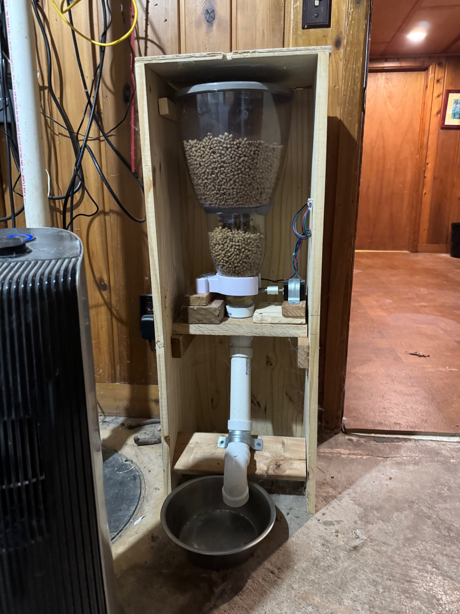
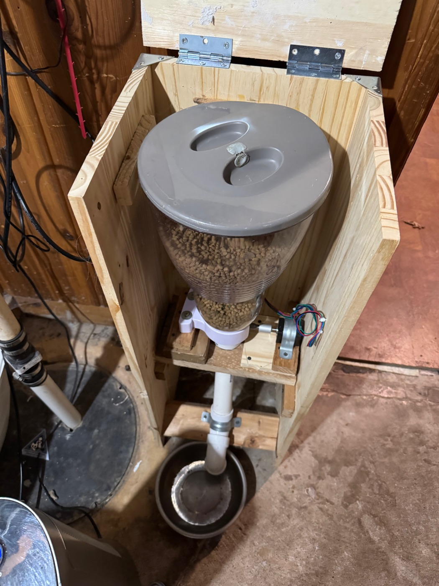
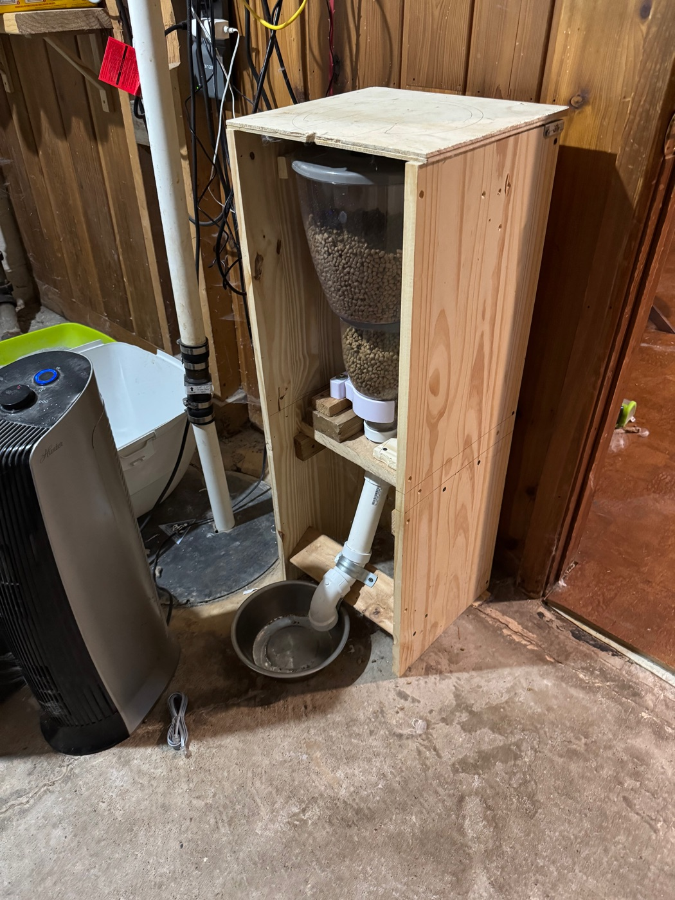
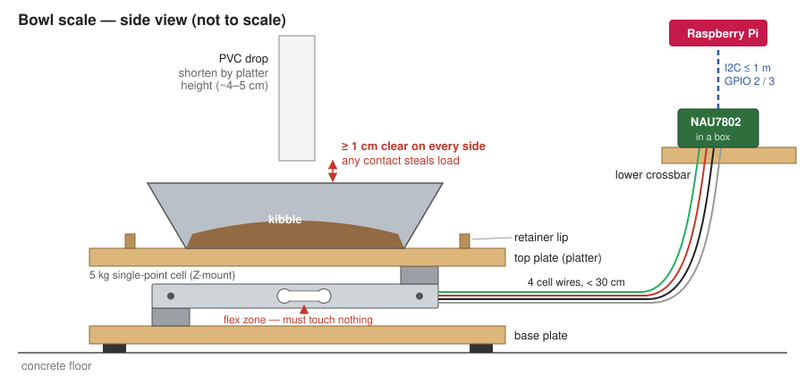

# Scale — Phase 1: bowl scale

Goal: weigh the bowl, so every dispense is measured in grams, a jam is
detected (motor ran, bowl didn't gain), and eating shows up as the bowl
emptying. Phase 2 (cat platform) puts this whole assembly on top of a
larger 4-cell platform, so nothing here gets thrown away.

## Current build (2026-10)

A countertop cereal dispenser is the hopper. The stepper turns its paddle
shaft through a coupler. Kibble falls down a PVC drop and elbow into a
steel bowl on the floor. There are no sensors.

| Front, open | Lid open | Closed |
|---|---|---|
|  |  |  |

## Target

## Parts

Prices are rough 2026 ballparks, not quotes.

| # | Part | Why this one | ~$ |
|---|------|--------------|----|
| 1 | **Single-point (straight bar) load cell, 5 kg**, aluminum, 4-wire (TAL220-style) | Single-point cells tolerate off-center loads — kibble lands off-center and cats shove the bowl. 5 kg is well over bowl+food (<1 kg), so a cat leaning on the bowl doesn't overload it, while still giving ~1 g resolution | 8–12 |
| 2 | **SparkFun Qwiic Scale (NAU7802)** | I2C 24-bit ADC. Avoids the HX711, whose bit-banged timing glitches under Linux scheduling | 15 |
| 3 | **Qwiic → female jumper cable**, 300–500 mm | Plugs straight onto the Pi header, no soldering | 2 |
| 4 | **Two rigid plates, ~25 × 25 cm** — ½" plywood or ¼" acrylic | Bottom = base, top = bowl platter. Must not flex: any flex reads as weight | 0–15 |
| 5 | **Mounting bolts + spacers/washers** for the cell (check its datasheet — usually M4 or M5) | Each plate bolts to one end of the bar. Spacers keep the cell's middle (the flexing part) clear of both plates | 3 |
| 6 | **Bowl retainer** — a wood lip/ring on the top plate, or a silicone mat | Stops cats pushing the bowl off the platter or into the chute | 0–8 |
| 7 | **Rubber feet** for the base | Grip on the concrete and some vibration damping | 3 |
| 8 | **Small project box** for the NAU7802 | Keeps the board off the floor (sump-pit humidity) | 5 |

**Total: about $35–65.** You'll also want a known weight for calibration:
a full 2 L bottle of water is about 2.0 kg. Check it on a kitchen scale if
you have one.

## Wiring

NAU7802 → Pi header. These pins are free: the stepper uses GPIO 12/13/16/17/19/20.

| NAU7802 | Pi pin | Function |
|---------|--------|----------|
| 3V3 | 1 | 3.3 V |
| GND | 6 | Ground |
| SDA | 3 | GPIO 2 / SDA |
| SCL | 5 | GPIO 3 / SCL |

The load cell's four wires go to the NAU7802 screw terminals: red E+,
black E−, white A−, green A+. Colors vary by vendor, so check the cell's
sheet. If the readings come out negative, swap A+ and A−.

**Placement:** mount the NAU7802 box on the lower crossbar, near the bowl.
The analog leads from the cell are low-level signals and pick up noise on
long runs, so keep them short (< 30 cm). The I2C run up to the Pi should
stay under ~1 m. If the Pi is farther away than that, add a Qwiic
differential I2C pair (PCA9615) rather than running bare I2C.

Enable I2C on the Pi with `sudo raspi-config` → Interface Options → I2C.
After wiring, `i2cdetect -y 1` should show the board at **0x2A**.

## Physical changes

- **Shorten the PVC drop** by the platter's height (probably 4–5 cm).
- **Keep at least 1 cm of clearance** between the elbow and the bowl or
  plates on every side. Any contact carries part of the load and the
  reading quietly goes wrong. Keeping the outlet inside the rim is fine,
  as long as it doesn't touch.
- The retainer from parts row 6 also stops a cat from pushing the bowl
  into the elbow.

## Software (sketch, not built yet)

- `scale.py`: reads the NAU7802 over I2C (`smbus2`), takes the median of
  short sample windows, and detects when the reading has settled. Tare and
  scale factor go in a small state file written with `write_atomic`.
- **Dispense verification:** take a settled reading before the motor runs
  and another ~3 s after, and add `grams` to the existing `dispense`
  event in `feeding_events.jsonl`. Don't add a new log line: the stats
  regexes only parse the "Feeding completed" family.
- **Jam alert:** if the motor ran and the gain is ≈ 0 g, log a `failure`
  event and send a Pushover alert.
- **Hopper:** the counter starts accumulating measured grams instead of
  cups × assumption, and refill feedback then only has to learn the
  capacity.
- **Calibration flow** (web UI): empty platter → tare; put the 2 L bottle
  on → set the scale factor; read it back to check.

## Phase 2 note: cats eating together

Two cats on the platform at once read as roughly A + B. When the total
matches the sum of the two known weights, log the visit as **shared**.
Food eaten during a shared visit counts toward the household total but
isn't split between the cats. Body-weight trends only use solo visits.
That way occasional shared meals don't spoil the data, though per-cat
intake numbers will undercount on the days the cats eat together.
